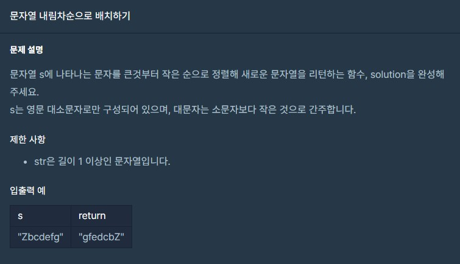

# 프로그래머스 Lv.1 "문자열 내림차순으로 배치하기"


# Solution

```swift
import java.util.*;
class Solution {
    public Object solution(String s) {
        char[] charS = s.toCharArray();
        Arrays.sort(charS);
        String str = new String(charS);
        StringBuffer answer = new StringBuffer(str);
        return answer.reverse().toString();
    }
}
```

##### 처음에 2중 for문을 이용하여 compareTo 함수로 아스키 값을 비교해 정렬을 했었는데 시간초과가 떴다.
##### 정렬후 뒤집는것을 목표로 잡고 sort, reverse를 사용 
